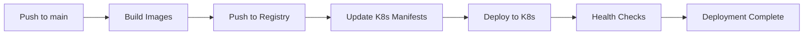

# 🚀 คู่มือการ Deploy Microservices ด้วย GitHub Actions และ Kubernetes

## 📋 สิ่งที่ได้สร้างให้คุณ

### 1. GitHub Actions Workflow
- **ไฟล์**: `.github/workflows/build-and-deploy.yml`
- **ฟีเจอร์**: Build Docker images, Push ไป registry, Deploy ไป K8s

### 2. เอกสารและสคริปต์
- **`GITHUB-ACTIONS-SETUP.md`** - คู่มือการตั้งค่าแบบละเอียด
- **`env.example`** - ตัวอย่าง environment variables
- **`scripts/setup-github-secrets.sh`** - สคริปต์ตั้งค่า secrets อัตโนมัติ
- **`k8s/production-overlay.yaml`** - การตั้งค่าสำหรับ production

## 🎯 ขั้นตอนการใช้งาน (Quick Start)

### ขั้นที่ 1: ตั้งค่า Kubernetes Cluster
```bash
# ตัวอย่างสำหรับ Google GKE
gcloud container clusters create microservices-demo \
  --zone=asia-southeast1-a \
  --num-nodes=3 \
  --machine-type=e2-medium

# หรือใช้ cluster ที่มีอยู่แล้ว
gcloud container clusters get-credentials YOUR_CLUSTER --zone YOUR_ZONE
```

### ขั้นที่ 2: ตั้งค่า GitHub Secrets
```bash
# วิธีที่ 1: ใช้สคริปต์อัตโนมัติ (แนะนำ)
./scripts/setup-github-secrets.sh

# วิธีที่ 2: ตั้งค่าด้วยตนเอง
cat ~/.kube/config | base64 -w 0
# คัดลอกผลลัพธ์ไปตั้งเป็น KUBE_CONFIG secret ใน GitHub
```

### ขั้นที่ 3: Push Code เพื่อ Deploy
```bash
git add .
git commit -m "Add GitHub Actions workflow"
git push origin main
```

### ขั้นที่ 4: ตรวจสอบ Deployment
```bash
# ดู GitHub Actions
# ไปที่ https://github.com/YOUR_USERNAME/YOUR_REPO/actions

# ตรวจสอบใน Kubernetes
kubectl get pods -n microservices-demo
kubectl get services -n microservices-demo
```

## 🔧 การปรับแต่งสำหรับ Production

### 1. ใช้ Production Overlay
```bash
# Deploy production configurations
kubectl apply -f k8s/production-overlay.yaml
```

### 2. ตั้งค่า Monitoring (ตัวเลือก)
```bash
# ติดตั้ง Prometheus และ Grafana
helm repo add prometheus-community https://prometheus-community.github.io/helm-charts
helm install monitoring prometheus-community/kube-prometheus-stack -n monitoring --create-namespace
```

### 3. ตั้งค่า Ingress (ตัวเลือก)
```yaml
# สร้างไฟล์ k8s/ingress.yaml
apiVersion: networking.k8s.io/v1
kind: Ingress
metadata:
  name: microservices-ingress
  namespace: microservices-demo
spec:
  rules:
  - host: api.yourdomain.com
    http:
      paths:
      - path: /
        pathType: Prefix
        backend:
          service:
            name: api-gateway
            port:
              number: 3000
```

## 🛠️ การแก้ไขปัญหาที่พบบ่อย

### 1. Build ล้มเหลว
```bash
# ตรวจสอบ Dockerfile
docker build -t test-image services/order-service/

# ดู logs ใน GitHub Actions
```

### 2. Deploy ล้มเหลว
```bash
# ตรวจสอบ kubeconfig
kubectl config current-context

# ตรวจสอบ namespace
kubectl get namespaces

# ดู pod logs
kubectl logs -f deployment/order-service -n microservices-demo
```

### 3. Image Pull Error
```bash
# ตรวจสอบ image registry
docker pull ghcr.io/YOUR_USERNAME/YOUR_REPO/order-service:latest

# ตรวจสอบ permissions
gh auth status
```

## 📊 การตรวจสอบสถานะ

### Dashboard Commands
```bash
# ดูสถานะทั้งหมด
kubectl get all -n microservices-demo

# ดู resource usage
kubectl top pods -n microservices-demo

# ดู events
kubectl get events -n microservices-demo --sort-by='.lastTimestamp'
```

### Health Checks
```bash
# ตรวจสอบ API Gateway
kubectl port-forward service/api-gateway 3000:3000 -n microservices-demo
curl http://localhost:3000/health

# ตรวจสอบแต่ละ service
kubectl port-forward service/order-service 3001:3001 -n microservices-demo
curl http://localhost:3001/health
```

## 🔒 Security Best Practices

### 1. Secrets Management
- ใช้ Kubernetes Secrets สำหรับข้อมูลลับ
- Rotate secrets เป็นระยะ
- ใช้ external secret management (เช่น HashiCorp Vault)

### 2. Network Security
- ใช้ Network Policies
- ตั้งค่า Ingress ด้วย TLS
- จำกัด port ที่เปิด

### 3. Image Security
- Scan images สำหรับ vulnerabilities
- ใช้ minimal base images
- Update dependencies เป็นระยะ

## 📈 การ Scale และ Performance

### Auto Scaling
```bash
# HPA ถูกตั้งค่าไว้แล้วใน production-overlay.yaml
kubectl get hpa -n microservices-demo
```

### Resource Monitoring
```bash
# ดู resource usage
kubectl top pods -n microservices-demo
kubectl describe node
```

## 🔄 CI/CD Pipeline Flow



## 📞 การขอความช่วยเหลือ

หากพบปัญหา:
1. ตรวจสอบ logs ใน GitHub Actions
2. ดู Kubernetes events และ pod logs
3. อ่านเอกสารใน `GITHUB-ACTIONS-SETUP.md`
4. ตรวจสอบ configuration ใน `env.example`

## 🎉 ขั้นตอนถัดไป

1. **ทดสอบ API**: ใช้ Postman หรือ curl ทดสอบ endpoints
2. **ตั้งค่า Monitoring**: ติดตั้ง Prometheus/Grafana
3. **เพิ่ม Tests**: เพิ่ม unit tests และ integration tests
4. **ตั้งค่า Staging**: สร้าง staging environment
5. **Documentation**: เขียน API documentation

---

**หมายเหตุ**: คู่มือนี้ครอบคลุมการใช้งานพื้นฐาน สำหรับการใช้งานขั้นสูง กรุณาอ่านเอกสารเพิ่มเติมในไฟล์ `GITHUB-ACTIONS-SETUP.md`
